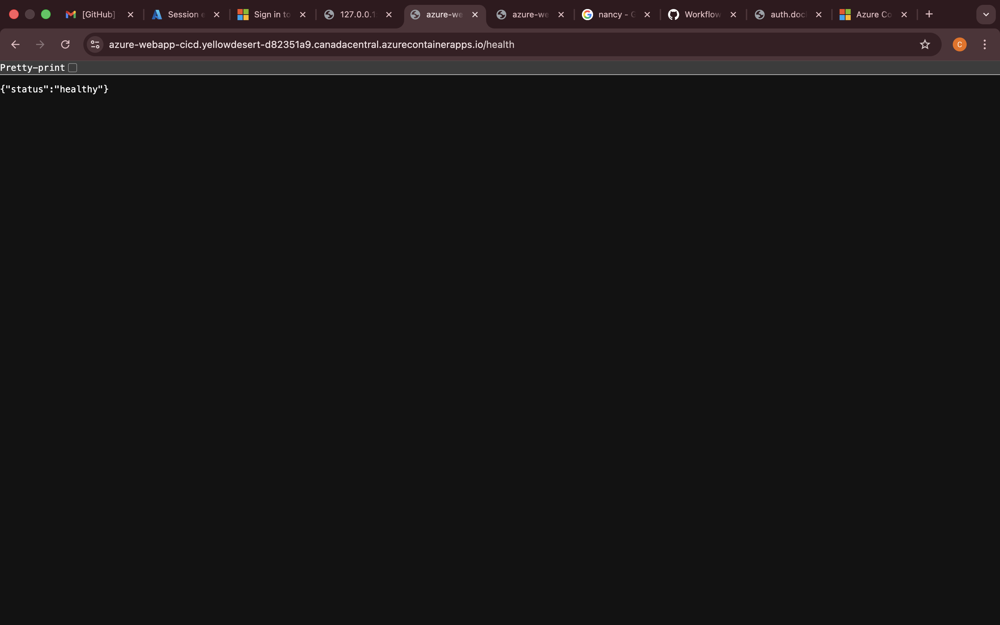
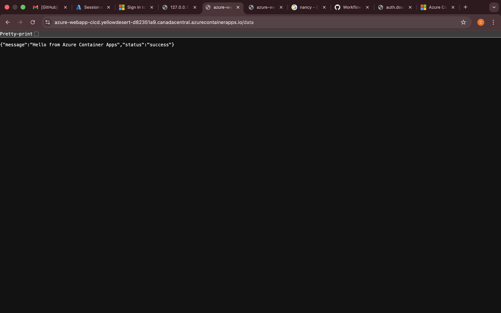
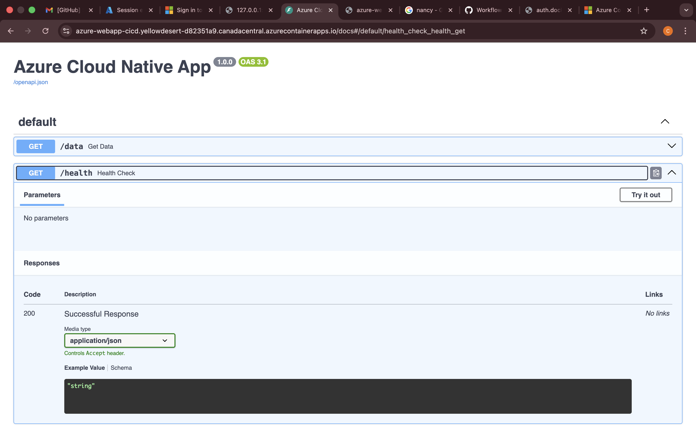
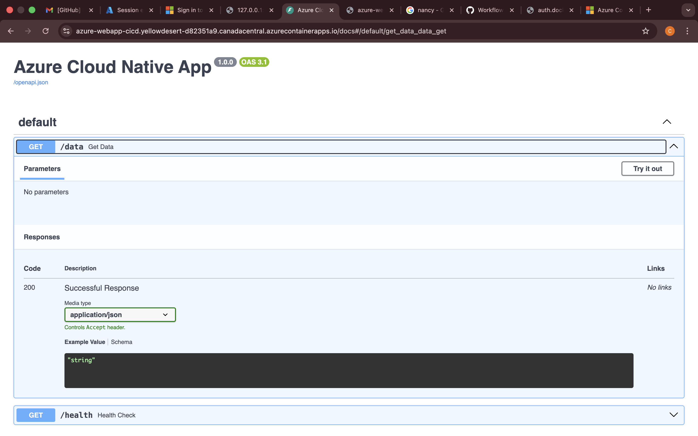
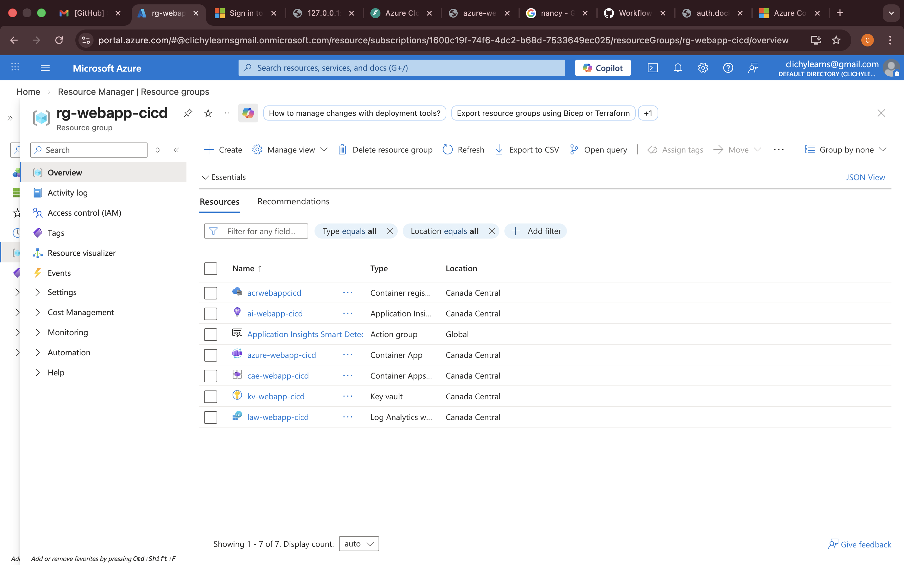
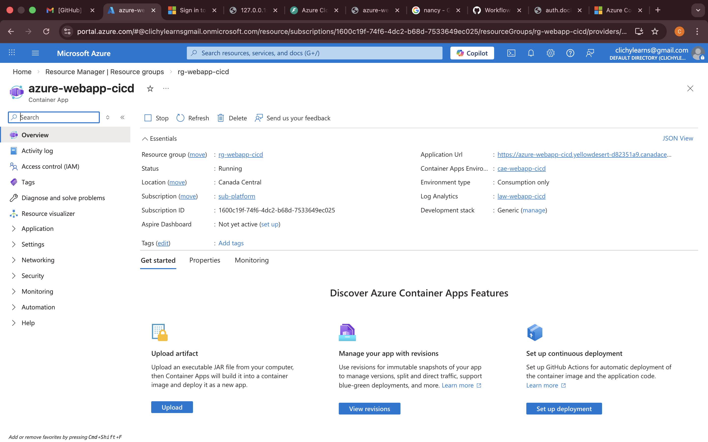
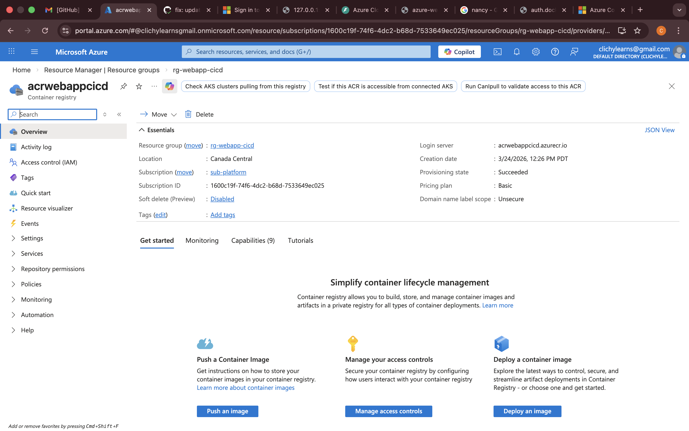
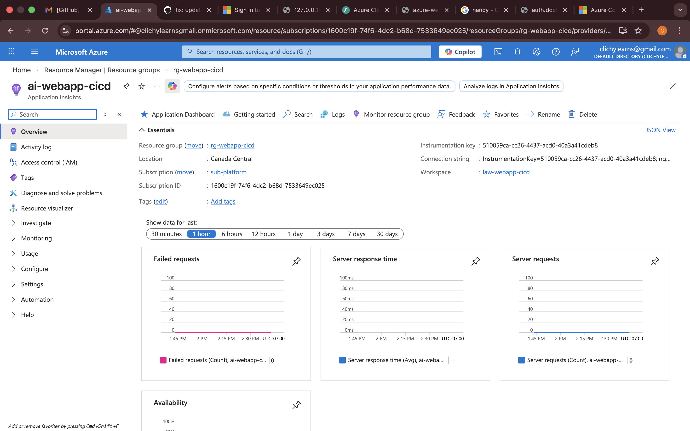
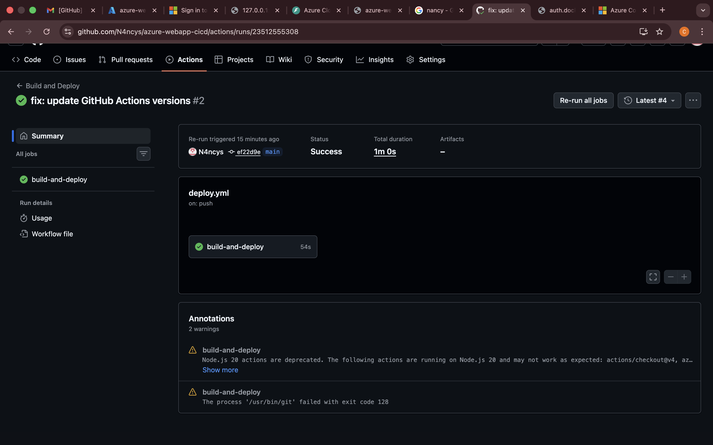

# azure-webapp-cicd
Production-style cloud-native web app deployed on Azure Container Apps with CI/CD, managed identity, Key Vault, and Terraform IaC.

# Azure Cloud-Native Web App with CI/CD

A production-style cloud-native web application deployed on Azure Container Apps with a fully automated CI/CD pipeline, managed identity, Key Vault integration, and infrastructure as code using Terraform.

---

## Architecture Overview

The application follows a cloud-native architecture with the following components:

- **FastAPI** — Python web framework serving `/health` and `/data` endpoints
- **Docker** — Application containerized for consistent deployments
- **Azure Container Registry (ACR)** — Stores Docker images securely
- **Azure Container Apps** — Runs the containerized application with scale-to-zero
- **Azure Key Vault** — Stores secrets with no hardcoded credentials
- **Azure Application Insights** — Monitors logs, metrics, and traces
- **GitHub Actions** — Automates build, test, and deployment pipeline
- **Terraform** — Provisions all infrastructure as code

---

## Architecture Diagram


---

## CI/CD Pipeline

Every push to the `main` branch triggers the following pipeline:

1. **Checkout** — pulls the latest code
2. **Login to Azure** — authenticates using a service principal
3. **Login to ACR** — authenticates to the container registry
4. **Build Docker image** — builds the image tagged with the commit SHA
5. **Push to ACR** — pushes the image to Azure Container Registry
6. **Deploy to Container Apps** — updates the running app with the new image

---

## Security Design Decisions

- **Managed Identity** — the Container App uses a system-assigned managed identity to pull images from ACR. No credentials are stored or passed.
- **Key Vault** — all secrets are stored in Azure Key Vault, never hardcoded
- **No admin credentials on ACR** — admin access is disabled, only managed identity is used
- **HTTPS only** — all traffic is served over HTTPS via Container Apps built-in ingress

---

## Screenshots

### Live Application



### API Documentation



### Azure Portal





### CI/CD Pipeline


---

## Project Structure
```
.
├── app/
│   ├── main.py           # FastAPI entrypoint
│   ├── routers/
│   │   └── data.py       # /data endpoint
│   ├── core/             # Logging and config
│   └── Dockerfile
├── infra/
│   ├── main.tf           # Root Terraform module
│   ├── variables.tf
│   ├── outputs.tf
│   └── modules/
│       ├── acr/          # Container Registry
│       ├── keyvault/     # Key Vault
│       ├── container_apps/ # Container Apps
│       └── monitoring/   # App Insights + Log Analytics
├── .github/
│   └── workflows/
│       └── deploy.yml    # CI/CD pipeline
└── tests/
```

---

## Future Improvements

- Add staging environment with slot-based deployments
- Implement Azure Front Door for global load balancing
- Add integration tests to the CI/CD pipeline
- Configure VNet integration for private networking
- Add Terraform remote state using Azure Storage backend

---

## Tech Stack

| Tool | Purpose |
|---|---|
| FastAPI | Web framework |
| Docker | Containerization |
| Terraform | Infrastructure as Code |
| GitHub Actions | CI/CD |
| Azure Container Apps | Application hosting |
| Azure Container Registry | Image storage |
| Azure Key Vault | Secrets management |
| Azure Application Insights | Observability |
